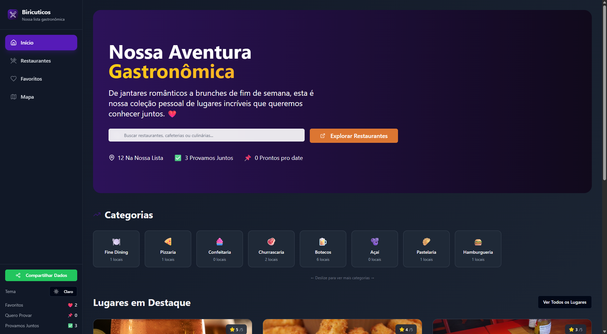
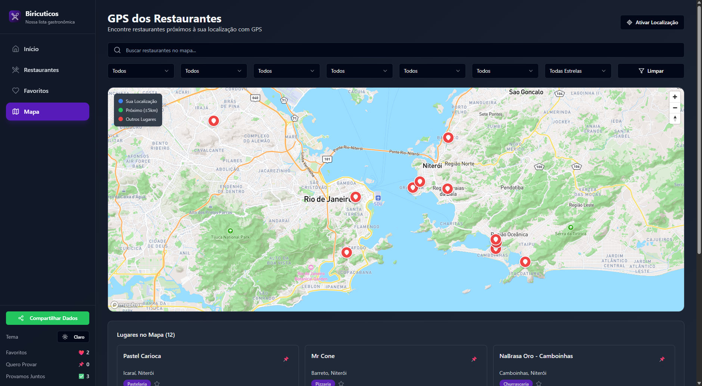
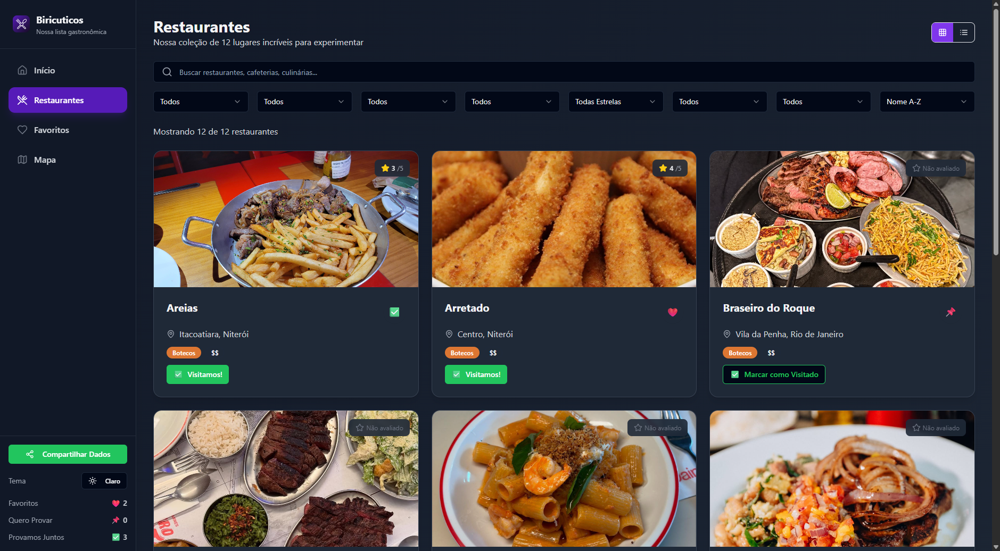

# Biricuticos

[](https://app.netlify.com/sites/your-app/deploys)
[](LICENSE)

**Biricuticos** is a collaborative platform to catalog, review, and discover restaurants, pizzerias, and other amazing places. Created with [Builder.io](https://www.builder.io/) and powered by a modern [React + TypeScript](https://www.typescriptlang.org/) stack, Biricuticos offers a beautiful, responsive, and highly customizable experience.

---

## 🚀 Features

- 📍 **Interactive Map**: Browse places on a map with custom markers and clustering for dense areas.
- 🔍 **Advanced Filtering**: Search by name, location, type, state, price, tags, wishlist, and rating.
- ❤️ **Wishlist & Favorites**: Mark places as favorites or add to your "want to try" list.
- ⭐ **User Ratings**: Rate places with 1-5 stars and see stats.
- 🗂️ **Catalog View**: Detailed list view with sorting and filtering.
- 💬 **Reviews & Notes**: Add private notes for each place (if enabled).
- 📱 **Responsive Design**: Smooth experience on desktop, tablet, and mobile.
- 🌙 **Dark Mode**: Automatic and manual dark mode support.
- ☁️ **Cloud Sync**: Backup or sync your data (optional).
- 🔒 **Privacy-first**: All your data stays local unless you choose to sync.

---

## 🖥️ Demo

[Live Demo](https://biricuticos.netlify.app/)

---

## 📸 Screenshots





---

## 🛠️ Getting Started

### Prerequisites

- [Node.js](https://nodejs.org/) (v18+ recommended)
- [npm](https://www.npmjs.com/) or [yarn](https://yarnpkg.com/)

### Installation

```bash
git clone https://github.com/macluel/Biricuticos.git
cd Biricuticos
npm install
# or yarn
```

### Development

```bash
npm run dev
# or yarn dev
```
Visit [http://localhost:5173](http://localhost:5173) to view the app.

### Build for Production

```bash
npm run build
# or yarn build
```

### Preview Production Build

```bash
npm run preview
# or yarn preview
```

---

## 🔧 Customization

Biricuticos is designed for easy adaptation:

- **Map Icons**: Edit `client/components/InteractiveMap.tsx`
- **Theme/Colors**: Customize in `tailwind.config.js` or your CSS.
- **Default Map Center/Zoom**: Change in `client/pages/MapView.tsx`
- **Add/Edit Place Types**: Update your data source or configuration.
- **Localization**: Easily translate labels in configuration files.

For more, see the [CUSTOMIZE.md](./CUSTOMIZE.md).

---

## 🧪 Testing

Biricuticos uses [Vitest](https://vitest.dev/) for testing.

```bash
npm run test
# or yarn test
```

---

## 🚦 Linting & Formatting

- **Lint:** `npm run lint`
- **Format:** `npm run format`

---

## 🎨 Tech Stack

- [React](https://react.dev/) + [Vite](https://vitejs.dev/)
- [TypeScript](https://www.typescriptlang.org/)
- [Tailwind CSS](https://tailwindcss.com/)
- [React-Leaflet](https://react-leaflet.js.org/) (maps)
- [Netlify Functions](https://docs.netlify.com/functions/overview/)
- [Vitest](https://vitest.dev/) (tests)

---

## 🏗️ Project Structure

```
Biricuticos/
├── client/                # Frontend code (React, TS)
│   ├── components/        # UI components
│   ├── contexts/          # React context providers
│   ├── pages/             # App pages (Home, Map, Catalog, etc)
│   ├── utils/             # Utilities and helpers
│   └── ...                # Other frontend code
├── netlify/functions/     # Serverless backend functions
├── public/                # Static assets
├── README.md
├── CUSTOMIZE.md
└── ...
```

---

## 🛡️ Security & Privacy

- All user data is stored locally in your browser by default.
- Optional cloud sync is opt-in, using your own storage.
- No personal data is collected or tracked.

---

## 🌍 Localization

- The UI is easily translatable. See `/client/locales/` for language files.
- Want to add your language? PRs are welcome!

---

## 🤝 Contributing

Pull requests, issues, and suggestions are welcome!

1. [Fork the repo](https://github.com/macluel/Biricuticos/fork)
2. Create your feature branch (`git checkout -b my-feature`)
3. Commit your changes (`git commit -am 'Add awesome feature'`)
4. Push to the branch (`git push origin my-feature`)
5. Open a Pull Request

See [CONTRIBUTING.md](./CONTRIBUTING.md) for more info.

---

## 📄 License

MIT License. See [LICENSE](./LICENSE).

---

## 🙏 Acknowledgements

- [Builder.io](https://www.builder.io/)
- [OpenStreetMap](https://www.openstreetmap.org/)
- [React-Leaflet](https://react-leaflet.js.org/)
- All contributors and testers!

---

## 💬 Support & Contact

Questions? Suggestions? Open an [issue](https://github.com/macluel/Biricuticos/issues) or contact [@macluel](https://github.com/macluel).

---
